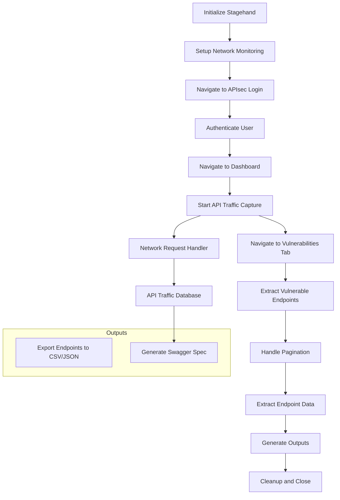

# Design Document: APIsec Vulnerability Scanner with Stagehand

**Date:** 2025-06-11
**Project:** APIsec API Traffic Monitoring and Vulnerability Extraction
**Author:** AI Assistant

## 1. Problem Statement

### Main Outcome and Requirements
Create an automated system using Stagehand to:
1. Navigate to the APIsec application dashboard
2. Authenticate using provided credentials
3. Monitor and capture all API network traffic during navigation
4. Extract vulnerable endpoints from the Vulnerabilities tab, which contains multiple pages
5. Export the vulnerable endpoints for reuse in an endpoint-analysis tool (json or csv)
6. Generate a swagger spec from captured API network traffic during navigation

### Success Criteria
- Successfully authenticate and navigate to the APIsec dashboard
- Capture detailed network request/response data for all API calls during the session
- Extract complete listing of vulnerability endpoints from all pages
- Generate structured output containing the API traffic analysis 
- Generate structured output of the vulnerable endpoints 
- Handle pagination and multiple data views automatically

### Constraints and Assumptions
- Requires valid APIsec credentials (APISEC_USERNAME, APISEC_PASSWORD)
- Network traffic monitoring must capture all API calls during the session
- Must handle dynamic content loading and pagination
- Should work with both local and Browserbase environments
- Must preserve sensitive authentication data securely

## 2. Exploration

Based on the Stagehand codebase analysis:

### Existing Patterns Found
1. **Authentication Handling**: Form filling patterns in `examples/form_filling_sensible.ts`
2. **Network Monitoring**: CDP Network events in `lib/StagehandPage.ts` (lines 473-622)
3. **Page Navigation**: Standard navigation patterns in examples
4. **Data Extraction**: Extract methods available in StagehandPage
5. **Context Management**: StagehandContext for session persistence

### Relevant Stagehand Capabilities
- `page.route()` for request/response interception
- `page.observe()` and `page.act()` for form interactions
- `page.extract()` for structured data extraction
- CDP Network domain access for detailed traffic monitoring
- Context persistence for authentication sessions

## 3. Design Document

### Architecture Overview



### Core Components

#### 1. Network Traffic Monitor
**Purpose**: Capture and analyze all API requests/responses.
**Implementation**: 
- Use Playwright's `page.route()` to intercept requests.
- Use CDP Network domain for detailed timing and headers.
- Store captured data in a structured format suitable for Swagger generation.

#### 2. Authentication Handler
**Purpose**: Securely login to APIsec platform.
**Implementation**:
- Use environment variables for credentials.
- Implement form detection and filling.
- Handle potential 2FA or additional security measures.

#### 3. Vulnerability Data Extractor
**Purpose**: Extract structured vulnerability data from the UI, including all details and associated logs.
**Implementation**:
- Use `page.extract()` with Zod schemas to ensure data integrity.
- Handle dynamic loading and pagination to capture all entries.
- Systematically extract endpoint information and all related vulnerability details.

#### 4. Output Generators
**Purpose**: Generate the final deliverable files.
**Implementation**:
- **Endpoint Exporter**: Processes the extracted vulnerability data and exports it to JSON and CSV formats.
- **Swagger Generator**: Analyzes the captured network traffic and synthesizes it into a valid OpenAPI/Swagger specification file.

### Data Structures

#### Network Request Schema
```typescript
interface NetworkRequest {
  id: string;
  method: 'GET' | 'POST' | 'PUT' | 'DELETE' | 'PATCH';
  url: string;
  headers: Record<string, string>;
  queryParams: Record<string, string>;
  requestBody?: string;
  responseStatus: number;
  responseHeaders: Record<string, string>;
  responseBody?: string;
  responseTime: number;
  timestamp: number;
}
```

#### Vulnerability Schema
```typescript
interface Vulnerability {
  method: string;
  endpoint: string;
  category: string;
  testType: string;
  cvssScore: number;
  cvssRating: string;
  resolutionStatus: string;
  detectionDescription: string;
  assertions: string[];
  remediation: string;
  logs: NetworkRequest[];
}
```

### Testing Strategy

#### Unit Tests
- Network request parsing and validation.
- Data extraction schema validation.
- Swagger generation logic for various request types.
- CSV/JSON export formatting.

#### Integration Tests
- End-to-end authentication flow.
- Network monitoring accuracy.
- Data extraction completeness across multiple pages.
- Correct correlation of network logs to vulnerabilities.

#### End-to-End Tests
- Complete workflow from login to final file generation.
- Error handling for network failures and unexpected UI changes.
- Performance testing with large numbers of vulnerabilities.

## 4. Implementation Plan

### Phase 1: Core Infrastructure (Week 1)
1. **Setup Project Structure**: Create the directory and file structure outlined below.
2. **Network Monitoring Foundation**: Implement robust request/response interception and storage.
3. **Authentication Module**: Implement the login flow, handling credentials securely.

### Phase 2: Data Extraction (Week 2)
1. **Vulnerability Data Extraction**:
   - Navigate to the Vulnerabilities tab.
   - Implement the extraction logic using the detailed `Vulnerability` schema.
   - Handle pagination to ensure all vulnerabilities are captured.
2. **Correlate Network Logs**:
   - Implement logic to associate the captured network logs with the specific vulnerability they relate to.

### Phase 3: Output Generation (Week 3)
1. **Endpoint Exporter**:
   - Create a module to process the array of `Vulnerability` objects.
   - Implement functions to export the data to both JSON and CSV files.
2. **Swagger/OpenAPI Generator**:
   - Create a module that takes the captured `NetworkRequest[]` data.
   - Implement logic to transform this data into a valid OpenAPI 3.0 specification.
3. **Error Handling and Resilience**:
   - Add comprehensive error logging and retry mechanisms for network and extraction tasks.

### File Structure
```
apisec-scanner/
├── src/
│   ├── main.ts                 # Entry point
│   ├── auth/
│   │   └── authenticator.ts    # Login handling
│   ├── monitoring/
│   │   └── networkMonitor.ts   # API traffic capture and storage
│   ├── extraction/
│   │   ├── vulnerabilityExtractor.ts  # Vulnerability data extraction
│   │   └── schemas.ts                 # Zod validation schemas
│   ├── output/
│   │   ├── swaggerGenerator.ts # Swagger spec generation
│   │   └── endpointExporter.ts # CSV/JSON export utilities
│   └── utils/
│       └── logger.ts           # Logging utilities
├── config/
│   └── stagehand.config.ts     # Stagehand configuration
├── tests/
│   ├── unit/
│   ├── integration/
│   └── e2e/
├── reports/                   # Directory for generated outputs
│   ├── vulnerable_endpoints.csv
│   ├── vulnerable_endpoints.json
│   └── swagger.json
├── .env.example
├── package.json
└── README.md
```

### Environment Variables
```bash
# APIsec Credentials
APISEC_USERNAME=your_username
APISEC_PASSWORD=your_password

# Stagehand Configuration
OPENAI_API_KEY=your_openai_key
BROWSERBASE_API_KEY=your_browserbase_key  # Optional
BROWSERBASE_PROJECT_ID=your_project_id   # Optional

# Application Configuration
HEADLESS=false
VERBOSE=2
OUTPUT_DIR=./reports
```

### Key Implementation Details

#### Vulnerability Extraction Pattern
```typescript
// Extract vulnerability data, including nested logs, and handle pagination
const allVulnerabilities: Vulnerability[] = [];
let hasNextPage = true;

while (hasNextPage) {
    const extractionResult = await page.extract({
      instruction: "Extract all vulnerability data from the table on the current page. For each vulnerability, include all details like description, remediation, assertions, and all associated network logs.",
      schema: z.object({
        vulnerabilities: z.array(VulnerabilitySchema), // Using the updated, detailed schema
        hasNextPage: z.boolean(),
      }),
    });

    allVulnerabilities.push(...extractionResult.vulnerabilities);
    hasNextPage = extractionResult.hasNextPage;

    if (hasNextPage) {
        await page.act("Click the 'Next Page' button");
    }
}
```

This design provides a comprehensive foundation for building the APIsec vulnerability scanner with Stagehand, ensuring robust network monitoring, secure authentication, and thorough data extraction capabilities. 